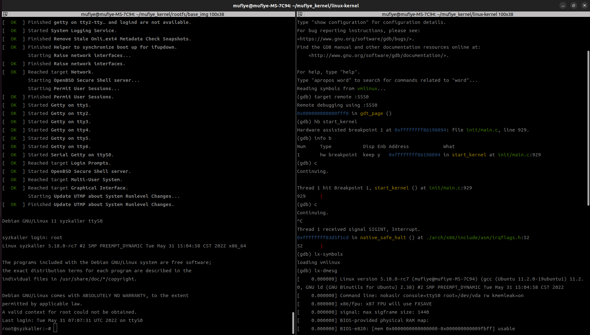

# 1. 相关软件包环境以及目录结构

**Qemu：**QEMU emulator version 6.2.0 (Debian 1:6.2+dfsg-2ubuntu6)

**GDB：**GNU gdb (Ubuntu 12.0.90-0ubuntu1) 12.0.90

**提示：**在编译内核时可能需要安装其它软件包，根据提示安装即可

```
mufiye_kernel(workspace)
	---- kernel-OLK-5.10(openEuler kernel source code)
	---- linux-kernel(linux kernel source code)
	---- rootfs(store image)
		---- base_img
			---- create_image.sh
			---- update-image.sh
			---- create-qcow2.sh
		---- 2.bullseye
		---- 3.bullseye3
```
# 2. 编译内核

1. [linux kernel git repo](https://git.kernel.org/pub/scm/linux/kernel/git/torvalds/linux.git)：本次编译使用的是该源码，版本为**5.18-rc7**

2. 应用该[patch](https://github.com/mufiye/mufiye_backup/blob/master/kernel_environment/0001-x86_64-debug.patch)使debug更方便（直接使用git am或对照修改）

3. config
  * 清理旧的编译生成的文件及其他配置等文件

   ```shell
   make mrproper
   ```

  * 首先生成.config（运行make menuconfig后直接save）

    ```shell
    make menuconfig
    ```

  * 根据该[config](https://github.com/mufiye/mufiye_backup/blob/master/kernel_environment/config)修改.config文件

  * 一些关于gdb调试的内核CONFIG选项：

    ```config
    CONFIG_KGDB=y
    CONFIG_DEBUG_BUGVERBOSE=y
    CONFIG_DEBUG_SECTION_MISMATCH=y  # 防止内联
    CONFIG_DEBUG_INFO=y
    CONFIG_DEBUG_KERNEL=y
    CONFIG_FRAME_POINTER=y  # Makefile中选择GCC编译选项
    CONFIG_GDB_SCRIPTS=y  # gdb python
    # 关闭CONFIG_DEBUG_RODATA
    # 关闭CONFIG_DEBUG_INFO_REDUCED
    # 关闭CONFIG_RANDOMIZE_BASE
    ```
4. 进行编译，先编译内核镜像

   ```shell
   make bzImage -j16
   ```

5. 编译模块

   ```shell
   make modules -j16
   ```

6. 进行模块安装

   ```shell
   # INSTALL_MOD_PATH表示模块安装的位置
   make modules_install INSTALL_MOD_PATH=mod -j16
   ```

# 3. 制作根文件系统
该节主要讲述如何制作根文件系统。

1. 安装debootstrap

   ```shell
   sudo apt install debootstrap
   ```

2. 使用[create-image.sh](https://github.com/mufiye/mufiye_backup/blob/master/kernel_environment/create-image.sh)创建镜像，create-image.sh用于创建一个适合syzkaller的最小Debian镜像。由于create-image.sh脚本文件过长，我提炼出其中的核心语句列出并做了注释（适用于x86_64）。

   ```shell
   bash ./create-image.sh
   ```

   ```shell
   #!/usr/bin/env bash
   # 一些预安装的软件包
   PREINSTALL_PKGS=openssh-server,curl,tar,gcc，...
   
   # 默认的安装变量
   ARCH=x86_64
   DEBARCH=amd64
   RELEASE=bullseye
   FEATURE=minimal
   SEEK=16383
   PERF=false
   
   # 略过了读取参数和一些相关设置，直接采用默认设置尽快进入主体代码
   
   # 安装目录
   DIR=chroot
   sudo rm -rf $DIR
   sudo mkdir -p $DIR
   sudo chmod 0755 $DIR
   
   # debootstrap将Debian基础系统安装到另一个已安装系统的子目录中  
   DEBOOTSTRAP_PARAMS="--arch=$DEBARCH --include=$PREINSTALL_PKGS -components=main,contrib,non-free $RELEASE $DIR"
   sudo debootstrap $DEBOOTSTRAP_PARAMS https://repo.huaweicloud.com/debian/
   
   # 这堆echo用于设定debian系统的一些参数，tee用于重定向
   # 找到root对应的行并将密码设置为空，x表示密码，但是这里不显示
   sudo sed -i '/^root/ { s/:x:/::/ }' $DIR/etc/passwd
   # 内核初始化时会读取/etc/inittab文件，每个条目的格式为id:runlevels:action:process，其中id为条目编号，runlevels表示运行级别，action表示要执行的动作，process表示要执行的程序，respawn的意思就是当后面的要执行的程序终止了，init进程会自动重启该进程。该命令使系统启动getty并提供登录提示到终端。
   echo 'T0:23:respawn:/sbin/getty -L ttyS0 115200 vt100' | sudo tee -a $DIR/etc/inittab
   # 设置网络
   printf '\nauto eth0\niface eth0 inet dhcp\n' | sudo tee -a $DIR/etc/network/interfaces
   # 设置挂载信息
   echo '/dev/root / ext4 defaults 0 0' | sudo tee -a $DIR/etc/fstab
   echo 'debugfs /sys/kernel/debug debugfs defaults 0 0' | sudo tee -a $DIR/etc/fstab
   echo 'securityfs /sys/kernel/security securityfs defaults 0 0' | sudo tee -a $DIR/etc/fstab
   echo 'configfs /sys/kernel/config/ configfs defaults 0 0' | sudo tee -a $DIR/etc/fstab
   echo 'binfmt_misc /proc/sys/fs/binfmt_misc binfmt_misc defaults 0 0' | sudo tee -a $DIR/etc/fstab
   # 设置域名解析文件
   echo -en "127.0.0.1\tlocalhost\n" | sudo tee $DIR/etc/hosts
   # 设置域名解析服务器号
   echo "nameserver 8.8.8.8" | sudo tee -a $DIR/etc/resolve.conf
   # 设置主机名为syzkaller
   echo "syzkaller" | sudo tee $DIR/etc/hostname
   # 创建并设置ssh密钥
   ssh-keygen -f $RELEASE.id_rsa -t rsa -N ''
   sudo mkdir -p $DIR/root/.ssh/
   cat $RELEASE.id_rsa.pub | sudo tee $DIR/root/.ssh/authorized_keys
   
   # 为vim2m驱动程序管理的设备创建一个/dev/vim2m符号链接，与syzkaller有关
   echo 'ATTR{name}=="vim2m", SYMLINK+="vim2m"' | sudo tee -a $DIR/etc/udev/rules.d/50-udev-default.rules
   
   # 创建虚拟化硬盘，块大小为1M，seek指定把块输出到文件时要跳过多少个块，count指定拷贝的块数，此时img中为空字符（因为/dev/zero）
   dd if=/dev/zero of=$RELEASE.img bs=1M seek=$SEEK count=1
   # 将镜像格式化为ext4文件系统
   sudo mkfs.ext4 -F $RELEASE.img
   sudo mkdir -p /mnt/$DIR
   # 挂载环回设备，此时该img被挂载，就像普通设备一样
   sudo mount -o loop $RELEASE.img /mnt/$DIR
   # 将之前创建的系统的内容拷贝到img中
   sudo cp -a $DIR/. /mnt/$DIR/.
   # 取消挂载
   sudo umount /mnt/$DIR
   ```
   
3. 移除生成的一些无用文件（密钥文件）

   ```shell
   rm bullseye.id_rsa*
   ```

4. 将img文件转换为.qcow2文件

   ```shell
   qemu-img convert -p -f raw -O qcow2 bullseye.img bullseye.qcow2
   ```
# 4. 安装并且配置qemu
1. 安装qemu

   ```shell
   sudo apt install qemu-system
   ```

1. 启动qemu前的准备（可以先直接到第3步试一试，不行再做这里的尝试）

   ```shell
   # 安装一些网络相关的包：
   sudo apt-get install qemu-kvm virt-manager bridge-utils
   ```
   ```shell
   # 修改/etc/qemu/bridge.conf
   mkdir -p /etc/qemu #如果没有qemu文件夹
   sudo vim /etc/qemu/bridge.conf #第一行加入 allow virbr0
   ```
   ```shell
   # 对/etc/ssh/sshd_config修改以下内容:
   PermitRootLogin yes #允许root用户登录
   PasswordAuthentication yes #开启密码认证
   PermitEmptyPasswords yes #允许密码为空
   ```

   ```shell
   # 非root用户没有权限的解决办法
   # 不同qemu可能qemu-bridge-helper位置不一样
   sudo find / -name qemu-bridge-helper # 先用这个命令确定文件的位置
   sudo chown root /usr/lib/qemu/qemu-bridge-helper # 将该文件的所有者改为root
   sudo chmod u+s /usr/lib/qemu/qemu-bridge-helper # setuid位为1表示设置使文件在执行阶段具有文件所有者的权限，该命令设置setuid位为1，setuid位占用属主执行位
   ```

1. 运行[update_image.sh](https://github.com/mufiye/mufiye_backup/blob/master/kernel_environment/update-image.sh)来启动qemu

   ```shell
   # kernel version表示的是内核源码的目录
   kernel_version=linux-kernel
   
   # -enable-kvm表示允许启用KVM,linux内核和硬件必须支持KVM并且加载kvm内核模块
   # -smp设置虚拟机的cpu数量，这里设置为16
   # -m表示设置虚拟机内存大小，这里设置为2G
   # -kernel指向启动qemu的内核镜像
   # -virtfs用于创建共享目录（虚拟机与物理机之间）
   # -nographic表示禁用图形输出并将串行I/O重定向到控制台，vga用于选择显卡类型
   # -append设置Linux内核命令行、启动参数，“console=ttyS0”表示把QEMU的输入输出定向到当前终端上，“root”指示根文件系统，"nokaslr"表示关闭KASRL，KASRL使内核地址空间布局随机化，这会让gdb难以调试
   # -device为设备设置驱动程序属性，-drive指定和标识该设备。如在该虚拟机启动项中，virtio-blk表示了驱动属性；用于此驱动设备的磁盘映像的路径为bullseye.qcow2，其文件格式为qcow2；缓存方式使用回写，也就是调用write写入数据时只将数据写入到磁盘缓存中，当数据被换出缓存时才写入到后端存储中；id为root，-device drive使连接到该id为root的设备。
   # -net nic创建一个网卡，并设置mac地址
   # -net bridge创建一个网桥
   qemu-system-x86_64 \
   -enable-kvm \
   -smp 16 \
   -m 2G \
   -kernel /home/mufiye/mufiye_kernel/${kernel_version}/arch/x86/boot/bzImage \
   -virtfs local,id=kmod_dev,path=/home/mufiye/mufiye_kernel/${kernel_version}/mod,readonly,mount_tag=9p,security_model=none \
   -vga none \
   -nographic \
   -append "nokaslr console=ttyS0 root=/dev/vda rw kmemleak=on" \
   -device virtio-scsi-pci \
   -drive file=bullseye.qcow2,if=none,format=qcow2,cache=writeback,file.locking=off,id=root \
   -device virtio-blk,drive=root,id=d_root \
   -net nic,model=virtio,macaddr=00:11:22:33:44:55 \
   -net bridge,br=virbr0 \
   ```

# 5. 创建根文件系统的拷贝
1. 首先进入rootfs文件夹，之后创建base_img并且将其它脚本文件移入到base_img文件夹。

   ```shell
   cd ./rootfs
   mkdir base_img
   mv * ./base_img
   ```

2. 创建两个新的文件夹用于装载新的镜像

   ```shell
   mkdir 2.bullseye
   mkdir 3.bullseye
   ```

3. 启动[create-qcow2.sh](https://github.com/mufiye/mufiye_backup/blob/master/kernel_environment/create-qcow2.sh)创建两个新的镜像并生成对应镜像的启动脚本start.sh（下面的代码块对脚本内容进行了提炼）

   ```shell
   bash create-qcow2.sh
   ```

   ```shell
   # create-qcow2.sh
   array=(2 3)
   image_type=bullseye
   dst_path=$(pwd)/../
   
   for element in ${array[@]}
   do
   	# 创建新的qcow2文件，相当于做了拷贝
   	qemu-img create -F qcow2 -b $(pwd)/${image_type}.qcow2 -f qcow2  \ 	                  					${dst_path}${element}.${image_type}/image.qcow2
   	
   	# 复制启动虚拟机的文件并做了一些修改
   	cp update-image.sh ${dst_path}/${element}.${image_type}/start.sh
   	
   	# 修改mac地址
   	format_num=$(printf "%02d\n" ${element})
   	sed -i "s/00:11:22:33:44:55/00:11:22:33:44:${format_num}/g" \      				                      ${dst_path}/${element}.${image_type}/start.sh
   	# 修改-drive file后跟的虚拟磁盘参数
   	sed -i "s/${image_type}.qcow2/image.qcow2/g" \                                                        ${dst_path}/${element}.${image_type}/start.sh
   	# 启动虚拟机时使其挂载两份额外的文件(放到之后介绍)
   	...
   	# 启动用于gdb调试的端口
   	gdb_port=`expr 5550 + $element`
   	echo "-gdb tcp::${gdb_port} \\" >> ${dst_path}/${element}.${image_type}/start.sh
   done
   ```

4. 进入到2.bullseye文件夹和3.bullseye文件夹并且为文件预分配空间

   ```shell
   fallocate -l 5G 1
   fallocate -l 5G nvme
   ```

5. 运行start.sh文件启动qemu虚拟机

   ```shell
   bash start.sh
   ```
   关于新的设备以及驱动设置
   
   ```shell
   # -drive和-device参数在上面的update_image.sh已经进行了介绍
   # 相当于新创建的虚拟机连接有两个新的设备，分别是scsi协议的硬盘和nvme协议的硬盘，设备的磁盘映像分别为之前分配的1文件和nvme文件
   -drive file=1,if=none,format=raw,cache=writeback,file.locking=off,id=dd_1 \
   -device scsi-hd,drive=dd_1,id=disk_1 \
   -drive file=nvme,if=none,format=raw,cache=writeback,file.locking=off,id=b_nvme_1 \
   -device nvme,drive=b_nvme_1,serial=d_b_nvme_1 \
   ```

# 6. gdb调试环境配置

## 6.1 配置gdb辅助调试功能

### 方法一

1. 向该文件~/.gdbinit输入内容

   ```shell
   echo "source /home/mufiye/.gdb-linux/vmlinux-gdb.py" > ~/.gdbinit
   ```

2. 创建文件夹

   ```shell
   mkdir ~/.gdb-linux/
   ```
   
3. 在linux源码文件夹中运行make命令

   ```shell
   make scripts_gdb
   ```

4. 复制文件到gdb-linux目录下

   ```shell
   cp -r scripts/gdb/* ~/.gdb-linux/
   ```
   
5. 向该文件输入内容

   ```shell
   # 输入的内容：sys.path.insert(0, "/home/mufiye/.gdb-linux")
   vim ~/.gdb-linux/vmlinux-gdb.py
   ```
   
6. 验证GDB辅助调试功能是否配置成功，用gdb vmlinux启动gdb后输入下面命令会有相关的提示

   ```shell
   (gdb) apropos lx
   ```

### 方法二

1. 向该文件~/.gdbinit输入内容

   ```shell
   echo "add-auto-load-safe-path /home/mufiye/mufiye_kernel/linux-kernel/scripts/gdb/vmlinux-gdb.py" > ~/.gdbinit
   ```

2. 在linux源码文件夹中运行make命令

   ```shell
   make scripts_gdb
   ```

## 6.2 启动gdb调试

1. gdb调试启动（在物理机上启动，之后远程连接虚拟机）

   ```shell
   gdb vmlinux
   ```

2. gdb远程连接qemu虚拟机（5552为端口号，这与启动qemu虚拟机时的设置有关）

   ```gdb
   target remote:5552
   ```

3. 之后就可以使用gdb进行调试了

## 6.3 gdb调试遇到的问题以及成功截图

### 问题1

第一个问题是不管何时都无法插入断点，无法读取内存内容，插入断点后函数内容为??()。该问题在gdb界面的错误提示为cannot insert breakpoint，cannot access memory adresss，我是在用break命令插入断点执行continue时遇到的该错误提示，同时插入断点时函数内容为??()。遇到该问题首先要考虑是否配置对了内核配置选项（见上面内核编译config配置），之后看看是否在用qemu启动内核时加入了nokaslr选项。

### 问题2

第二个问题是在内核启动前无法插入断点，无法读取内存内容。在这种情况下，插入断点函数内容不为??()，在内核启动后插入断点一切正常，但是在内核启动前插入断点并continue，仍然出现cannot insert breakpoint，cannot access memory adresss的错误提示。此时我尝试使用hbreak，我发现使用hbreak不会发生错误并能够正常断点。

关于hbreak和break的区别，我查阅资料得知：break设置的是软件断点，由非法指令异常实现（软件实现），其中断的程序位于内存中；hbreak设置的是硬件端点，由硬件特性实现，其中断的程序位于只读寄存器中。当代码位于只读寄存器时，只能通过硬件断点调试。所以我猜测是内核启动过程中，start_kernel这段程序被加载到只读寄存器中，因此只能通过hbreak进行断点。

### gdb配置成功截图



<center>gdb调试，成功断点start_kernel函数</center>
# 参考

1. https://github.com/chenxiaosonggithub/blog
2. 《Linux内核设计与实现》
3. https://www.kernel.org/doc/htmldocs/kgdb/CompilingAKernel.html
4. [qemu官方文档](https://qemu.readthedocs.io/en/latest/system/quickstart.html)
5. [Getting started with qemu](https://drewdevault.com/2018/09/10/Getting-started-with-qemu.html)
6. [Debugging kernel and modules via gdb](https://www.kernel.org/doc/Documentation/dev-tools/gdb-kernel-debugging.rst)
7. [GDB官方文档](https://sourceware.org/gdb/current/onlinedocs/gdb/)
8. [QEMU+gdb调试Linux内核全过程](https://blog.csdn.net/jasonLee_lijiaqi/article/details/80967912)
9. [linux kernel调试环境](https://s3.shizhz.me/s3e1)
10. [linux内存子系统 - qemu调试linux 内核启动](https://zhuanlan.zhihu.com/p/363827057)
11. https://sourceware.org/legacy-ml/gdb/2016-08/msg00014.html
12. [关于linux内核kgdb调试](https://linux.cn/forum.php?mod=viewthread&tid=16243)
13. [关于hbreak和break](https://blog.51cto.com/u_11134889/2083650)

